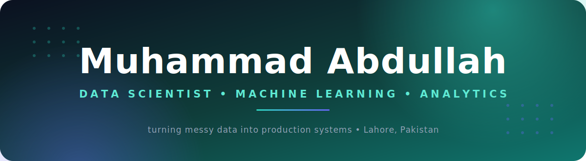
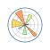
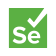

<!-- ════════  HERO BANNER + Skills (uniform self-hosted SVG icons, 56px canvas) & Work (metric badges)  ════════ -->

<div align="center">



<br/>
<br/>

<a href="https://www.linkedin.com/in/muhammadabdullahwasim/"></a>
<a href="mailto:maw180604@gmail.com"></a>


</div>

<br/>

<picture><source media="(prefers-color-scheme: dark)" srcset="assets/icons/h-about-d.svg"/></picture>

I'm a data scientist who works close to the metal of real systems: the pipelines, the queries, and the models that have to keep working after the demo is over. My day is equal parts engineering and analysis: standing up data infrastructure that's reliable, optimizing the slow parts, and building models whose results I can actually defend. I'm drawn to depth over flash, and right now I'm deliberately strengthening my classical ML and statistics foundations to go further.

```
→  Self-hosted analytics platforms · pipelines (raw → enriched → mart) · sub-second SQL over millions of rows
→  Deep learning for medical imaging · classical ML · rigorous model evaluation
→  FastAPI + DuckDB-over-Parquet backends · query optimization · reproducible data flows
```

<br/>

<picture><source media="(prefers-color-scheme: dark)" srcset="assets/icons/h-stack-d.svg"/></picture>

<table width="100%">
<tr>
<td valign="top" width="50%">

<picture><source media="(prefers-color-scheme: dark)" srcset="assets/icons/h-languages-d.svg"/></picture>


</td>
<td valign="top" width="50%">

<picture><source media="(prefers-color-scheme: dark)" srcset="assets/icons/h-ds-d.svg"/></picture>





</td>
</tr>
<tr>
<td valign="top" width="50%">

<picture><source media="(prefers-color-scheme: dark)" srcset="assets/icons/h-dataeng-d.svg"/></picture>


</td>
<td valign="top" width="50%">

<picture><source media="(prefers-color-scheme: dark)" srcset="assets/icons/h-web-d.svg"/></picture>





</td>
</tr>
<tr>
<td valign="top" width="50%">

<picture><source media="(prefers-color-scheme: dark)" srcset="assets/icons/h-analytics-d.svg"/></picture>


</td>
<td valign="top" width="50%">

<picture><source media="(prefers-color-scheme: dark)" srcset="assets/icons/h-tools-d.svg"/></picture>


</td>
</tr>
</table>

<br/>

<picture><source media="(prefers-color-scheme: dark)" srcset="assets/icons/h-work-d.svg"/></picture>

<picture><source media="(prefers-color-scheme: dark)" srcset="assets/icons/h-neura-d.svg"/></picture>

A deep-learning system for **3D MRI tumor segmentation**. An **nnU-Net v2** model trained on 350 BraTS 2021 cases across four MRI modalities, shipped as a web app that returns color-coded segmentation overlays with live evaluation metrics.


&nbsp;&nbsp;&nbsp; <kbd>PyTorch</kbd> <kbd>Flask</kbd>

<sub>🔒 Repository opens after degree completion (academic policy)</sub>

<br/>

<picture><source media="(prefers-color-scheme: dark)" srcset="assets/icons/h-platform-d.svg"/></picture>

A single-window platform that replaced fragmented manual reporting. A **FastAPI + DuckDB-over-Parquet** backend serving sub-second analytical reads, fed by a three-stage pipeline (raw → enriched → mart).


&nbsp;&nbsp;&nbsp; <kbd>FastAPI</kbd> <kbd>DuckDB</kbd> <kbd>Parquet</kbd>

<sub>💼 Built in a professional setting</sub>

<br/>

<div align="center">

### Let's connect

I'm open to data science & ML roles, remote or open to relocation.

<a href="https://www.linkedin.com/messaging/compose/?recipient=muhammadabdullahwasim"></a>

</div>
