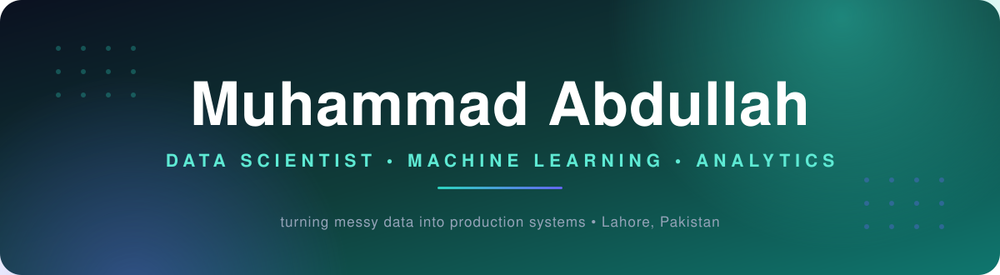
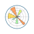

<!-- ════════  HERO BANNER + Skills (uniform self-hosted SVG icons, 56px canvas) & Work (metric badges)  ════════ -->

<div align="center">



<br/>
<br/>

<a href="https://www.linkedin.com/in/muhammadabdullahwasim/"></a>
<a href="mailto:maw180604@gmail.com"></a>


</div>

<br/>

<picture><source media="(prefers-color-scheme: dark)" srcset="assets/icons/h-about-d.svg"/></picture>

I'm a data scientist who works close to the metal of real systems: the pipelines, the queries, and the models that have to keep working after the demo is over. My day is equal parts engineering and analysis: standing up data infrastructure that's reliable, optimizing the slow parts, and building models whose results I can actually defend. I'm drawn to depth over flash, and right now I'm deliberately strengthening my classical ML and statistics foundations to go further.

```
→  Self-hosted analytics platforms · pipelines (raw → enriched → mart) · sub-second SQL over millions of rows
→  Deep learning for medical imaging · classical ML · rigorous model evaluation
→  FastAPI + DuckDB-over-Parquet backends · query optimization · reproducible data flows
```

<br/>

<picture><source media="(prefers-color-scheme: dark)" srcset="assets/icons/h-stack-d.svg"/></picture>

<table width="100%">
<tr>
<td valign="top" width="50%">

<picture><source media="(prefers-color-scheme: dark)" srcset="assets/icons/h-languages-d.svg"/></picture>


</td>
<td valign="top" width="50%">

<picture><source media="(prefers-color-scheme: dark)" srcset="assets/icons/h-ds-d.svg"/></picture>





</td>
</tr>
<tr>
<td valign="top" width="50%">

<picture><source media="(prefers-color-scheme: dark)" srcset="assets/icons/h-dataeng-d.svg"/></picture>


</td>
<td valign="top" width="50%">

<picture><source media="(prefers-color-scheme: dark)" srcset="assets/icons/h-web-d.svg"/></picture>


</td>
</tr>
<tr>
<td valign="top" width="50%">

<picture><source media="(prefers-color-scheme: dark)" srcset="assets/icons/h-analytics-d.svg"/></picture>


</td>
<td valign="top" width="50%">

<picture><source media="(prefers-color-scheme: dark)" srcset="assets/icons/h-tools-d.svg"/></picture>


</td>
</tr>
</table>

<br/>

<picture><source media="(prefers-color-scheme: dark)" srcset="assets/icons/h-work-d.svg"/></picture>

<picture><source media="(prefers-color-scheme: dark)" srcset="assets/icons/h-neura-d.svg"/></picture>

*A deep-learning system for 3D brain tumor segmentation from MRI, carried from training to a working app instead of left in a notebook.*

Trained an **nnU-Net v2** full-resolution model on **BraTS 2021** across **four MRI modalities** to a **0.92 whole-tumor Dice**, benchmarked against a from-scratch **3D U-Net** baseline, and trained inside Kaggle **T4** session limits. Built the full preprocessing and evaluation pipeline **end to end** (NIfTI loading, z-score normalization, resampling, augmentation, combined **Dice and Cross-Entropy loss** with **AdamW**). Shipped the trained model inside **NEURA**, a **Flask** app serving live inference that returns color-coded segmentation overlays scored against ground truth.


> 🔒 Repository opens after degree completion (academic policy)

<br/>

<picture><source media="(prefers-color-scheme: dark)" srcset="assets/icons/h-platform-d.svg"/></picture>

*A single-window platform that put self-serve KPI analytics in the operations team's hands, replacing fragmented manual reporting.*

Replaced delayed weekly and monthly reporting with **on-demand access to every KPI** and the case-level detail behind it. Redesigned the aggregation layer around a **one-row-per-case model** with precomputed flags, turning expensive distinct-count operations into simple additive counts, which made the main detail page **roughly 8 to 10x faster** with output **byte-identical** to the legacy reports. Unified **7 separate sources** into one cleaned, schema-validated feed on a **FastAPI** backend querying **DuckDB** over partitioned **Parquet**, fed by a **raw-enriched-mart** pipeline. Retired **6 Tableau workbooks** and **8 to 10 hours a week** of manual reporting.


> 💼 Built in a professional setting

<br/>

<picture><source media="(prefers-color-scheme: dark)" srcset="assets/icons/h-radiology-d.svg"/></picture>

*A web app that broke radiology turnaround down deep enough to find exactly where cases were stalling.*

Broke radiology turnaround down by **workflow stage, radiologist, modality, and shift**, refreshed **hourly** in place of the old weekly reports that showed only the headline number. Surfaced exactly where cases were stalling past a **24-hour SLA**, and acting on those bottlenecks **cut turnaround by more than 75%**, to well under the SLA. Added a geographic view across centers and a searchable, filterable case browser.


> 💼 Built in a professional setting

<br/>

<picture><source media="(prefers-color-scheme: dark)" srcset="assets/icons/h-chatlens-d.svg"/></picture>

*An LLM-integrated tool that turns long WhatsApp exports into a clear record of what was promised and what is still open.*

Turns long WhatsApp chat exports into **structured business summaries** covering **action items, decisions, blockers, and open follow-ups**, from both a client-facing and an internal-team view. Pairs a fully local **rule-based engine** (English and Roman-Urdu) for in-browser processing with an optional **Claude or OpenAI API** layer for richer natural-language summaries. Parses both **Android and iOS** export formats with automatic date detection, and exports to **PDF**.


> 💼 Built in a professional setting

<br/>

<div align="center">

Open to data science & ML roles, remote or relocation.

<a href="https://www.linkedin.com/messaging/compose/?recipient=muhammadabdullahwasim"></a>

</div>
